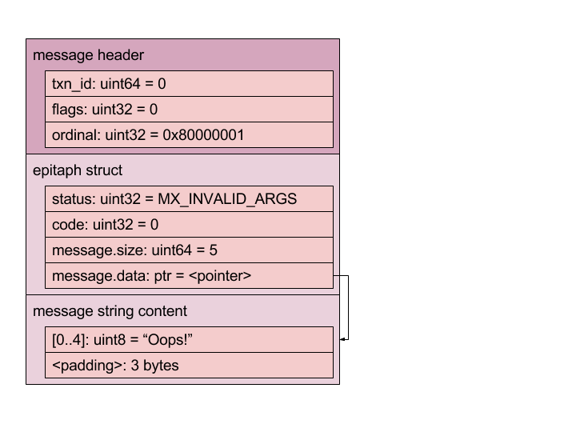

<!-- # FIDL: Wire Format Specification -->
# FIDL：有线格式规范
----

[*英文原文快照*](https://github.com/fuchsia-mirror/zircon/blob/3c02d55407f1f2a2afa5ff4cd2ca5213186590a0/docs/fidl/wire-format/index.md)

----
<!-- This document is a specification of the Fuchsia Interface Definition Language
(FIDL) data structure encoding. -->
本文档是Fuchsia接口定义语言(FIDL)数据结构的编码规范。

<!-- See [FIDL: Overview](../index.md) for more information about FIDL's overall
purpose, goals, and requirements, as well as links to related documents. -->

有关FIDL的总体目的，目标和要求以及相关文档的链接的更多信息，请参阅[FIDL：概述](../index.md)。

<!-- TOC -->
- [设计](#设计)
    - [目标](#目标)
    - [消息](#消息)
- [数据类型](#数据类型)
    - [基本类型](#基本类型)
    - [枚举(Enum)](#枚举enum)
    - [数组(Array)](#数组array)
    - [字符串(String)](#字符串string)
    - [向量(Vector)](#向量vector)
    - [句柄(Handle)](#句柄handle)
    - [结构体(Struct)](#结构体struct)
    - [联合体(Union)](#联合体union)
    - [事务消息](#事务消息)
- [细节](#细节)
- [脚注](#脚注)
<!-- /TOC -->

<!-- ## Design -->
## 设计

<!-- ### Goals -->
### 目标

<!-- *   Efficiently transfer messages between processes. -->
*   在进程之间高效地传输消息。
<!-- *   General purpose, for use with device drivers, high-level services, and
    applications. -->
*   通用性，用于设备驱动程序、高层次服务和应用程序。
<!-- *   Optimized for Zircon IPC only; portability is not a goal. -->
*   仅针对Zircon的IPC进行了优化；可移植性不是其目标。
<!-- *   Optimized for direct memory access; inter-machine transport is not a goal. -->
*   针对直接内存访问进行了优化；支持机器间的传输不是其目标。
<!-- *   Optimized for 64-bit only; no accommodation for 32-bit environments. -->
*   仅针对64位进行了优化；未适配32位环境。
<!-- *   Uses uncompressed native data types with host-endianness and correct
    alignment to support in-place access of message contents. -->
*   使用具有主机大小端和正确对齐的原生未压缩数据类型，以支持对消息内容的原地访问。
<!-- *   Compatible with C structure in-memory layout (with suitable field ordering
    and packing annotations). -->
*   兼容C语言结构的内存布局（具有合适的字段顺序和对齐注解）。
<!-- *   Structures are fixed size and inlined; variable-sized data is stored
    out-of-line. -->
*   结构尺寸固定并且内联；可变大小数据以外联方式存储。
<!-- *   Structures are not self-described; FIDL files describe their contents. -->
*   结构是不可自我描述的；需要FIDL文件描述它们的内容。
<!-- *   No versioning of structures, but interfaces can be extended with new methods
    for protocol evolution. -->
*   不对结构进行版本控制，但可以使用新的协议演化方法扩展接口。
<!-- *   No offset calculations required, very little arithmetic which may overflow. -->
*   不需要偏移计算，仅有极少的算术可能会溢出。
<!-- *   Support fast single-pass encoding and validation (as a combined operation). -->
*   支持（作为组合操作的）快速单通道编码和验证。
<!-- *   Support fast single-pass decoding and validation (as a combined operation). -->
*   支持（作为组合操作的）快速单通道解码和验证。

<!-- ### Messages -->
### 消息

<!-- A **message** is a contiguous data structure represented using the FIDL Wire
Format, consisting of a single **in-line primary object** followed by a sequence
of **out-of-line secondary objects** stored in **traversal order**. -->
**消息**是使用FIDL有线格式表示的连续数据结构，由单个**内联主对象**以及一系列**外联次级对象**组成，以**遍历的顺序**进行存储。

<!-- #### Objects -->
#### 对象

<!-- Messages are aggregates of **objects**. -->
消息是**对象**的聚合。

<!-- The **primary object** of a message is simply the first object it contains. It
is always a **struct** of fixed size whose type (and size) is known from the
context (such as by examining the **method ordinal** in the **interface call
header**). -->
消息的**主对象**是它包含的第一个对象。
主对象始终是固定大小的**结构体**，其类型（和大小）在上下文中是已知的（例如通过检查**接口调用头**中的**方法序数**）。

<!-- To store variable-size or optional data, the primary object may refer to
**secondary objects**, such as string content, vector content, structs, and
unions. Secondary objects are stored **out-of-line** sequentially in traversal
order following the object which reference them. In encoded messages, the
presence of secondary objects is marked by a flag. In decoded messages, the
flags are substituted with pointers to their location in memory (or null
pointers when absent). -->
为了存储可变大小或可选数据，主对象可以引用**次级对象**，例如字符串内容，向量内容，结构体和联合体等。 
次要对象以遍历的先后顺序，并紧跟引用它们的对象存储在**线外**。 
在编码的消息中，次级对象的存在由标志符标记，在解码的消息中，标志被指向它们在内存中位置的指针（或者在没有次级对象时的空指针）所替换。

<!-- Primary and secondary objects are 8-byte aligned and stored sequentially in
traversal order without gaps other than the minimum required padding to maintain
object alignment. -->
主对象和次级对象是8字节对齐的，并且以遍历的先后顺序存储，除了最小所需填充以保持对象对齐之外没有其他间隔。

<!-- Objects may also contain **in-line objects** which are aggregated within the
body of the containing object, such as embedded structs and fixed-size arrays of
structs. The alignment factor of in-line objects is determined by the alignment
factor of their most restrictive member. -->
对象还可能包含其他**内联对象**，它们在包含它们的对象主体内聚合。
例如嵌入的结构体和固定大小的结构体数组。 
内联对象的对齐因子由其最具限制性的成员的对齐因子确定。

<!-- In the following example, each Rect structure contains two Point objects which
are stored in-line whereas each Region structure contains a vector with a
variable number of Rect objects which are stored sequentially out-of-line. In
this case, the secondary object is the vector's content (as a unit). -->
在下面的示例中，每个Rect结构体包含两个内联存储的Point对象，而每个Region结构体包含一个向量，该向量具有可变数量的Rect对象，这些对象按顺序外联存储。 
在这种情况下，次级对象是向量（作为一个单元）的内容。

```
struct Region {
    vector<Rect> rects;
};
struct Rect {
    Point top_left;
    Point bottom_right;
};
struct Point { uint32 x, y; };
```


<!-- #### Traversal Order -->
#### 遍历顺序

<!-- The **traversal order** of a message is a determined by a recursive depth-first
walk of all of the **objects** it contains, as obtained by following the chain
of references. -->
消息的**遍历顺序**由它包含的所有（通过追踪引用链获得的）**对象**的递归深度优先的顺序所确定。

<!-- Given the following structure: -->
给定以下结构体：

```
struct Cart {
    vector<Item> items;
};
struct Item {
    Product product;
    uint32 quantity;
};
struct Product {
    string sku;
    string name;
    string? description;
    uint32 price;
};
```
<!-- 
The depth-first traversal order for a Cart message is defined by the following
pseudo-code: -->
Cart消息的深度优先遍历顺序由以下伪代码定义：

```
visit Cart:
    for each Item in Cart.items vector data:
        visit Item.product:
                visit Product.sku
                visit Product.name
                visit Product.description
                visit Product.price
            visit Item.quantity
```

<!-- #### Dual Forms -->
#### 双重形式
<!-- The same message content can be expressed in two forms -- **encoded** and
**decoded** -- which have the same size and overall layout but differ in terms
of their representation of pointers (memory addresses) or handles
(capabilities). -->
相同的消息内容可以用两种形式表示——**编码的**和**解码的**——它们具有相同的大小和总体布局，但在指针（内存地址）或句柄（功能）的表示方面有所不同。

<!-- FIDL is designed such that **encoding** and **decoding** of messages can occur
in place in memory assuming that objects have been stored in traversal order. -->
FIDL的设计使得，如果对象已经以遍历先后顺序存储，那么**编码**和**解码**可以在内存中直接进行。

<!-- The representation of encoded messages is unambiguous. There is exactly one
possible encoding for all messages of the same type with the same content. -->
编码的消息的表示是明确无歧义的。 
对于所有具有相同内容的相同类型的消息，只可能有一种编码结果。


<!-- #### Encoded Messages -->
#### 编码的消息

<!-- An **encoded message** has been prepared for transfer to another process: it
does not contain pointers (memory addresses) or handles (capabilities). -->
**编码的消息**可被用于传输到另一个进程：它不包含指针（内存地址）或句柄（功能）。

<!-- During **encoding**… -->
在**编码期间**……

<!-- *   all pointers to sub-objects within the message are replaced with flags which
    indicate whether their referent is present or not-present in traversal order -->
*   所有指向消息中子对象的指针都被，指示它们的引用是否存在于遍历顺序中的标志所替换
<!-- *   all handles within the message are extracted to an associated **handle
    vector** and replaced with flags which indicate whether their referent is
    present or not-present in traversal order -->
*   消息中的所有句柄都被提取到关联的**句柄向量**中并用指示它们的所指对象是否存在于遍历顺序中的标志所替换

<!-- The resulting **encoding message** and **handle vector** can then be sent to
another process using **zx_channel_call()** or a similar IPC mechanism. -->
然后可以使用**zx_channel_call()** 或类似的IPC机制将得到的**编码的消息**和**句柄向量**发送到另一个进程。

<!-- #### Decoded Messages -->
#### 解码的消息

<!-- A **decoded message** has been prepared for use within a process's address
space: it may contain pointers (memory addresses) or handles (capabilities). -->
**解码的消息**可用于在进程的地址空间中使用：它可以包含指针（存储器地址）或句柄（能力）。

<!-- During **decoding**... -->
**解码期间** ...

<!-- *   all pointers to sub-objects within the message are reconstructed using the
    encoded present / not-present flags in traversal order -->
*   以遍历先后顺序，消息内的子对象指针都使用，编码后的是否存在该子对象的标志中重建
<!-- *   all handles within the message are restored from the associated **handle
    vector** using the encoded present / not-present flags in traversal order -->
*   以遍历先后顺序，消息中的所有句柄都使用，编码后的是否存在该句柄的标志从关联的**句柄向量**中恢复。
<!-- The resulting **decoded message** is ready to be consumed directly from memory. -->
得到的**解码后消息**可直接在内存中使用。

<!-- ## Data Types -->
## 数据类型

<!-- ### Primitives -->
### 基本类型

<!-- *   Value stored in native machine format. -->
*   以原生机器格式存储的值。
<!-- *   Packed with natural alignment. -->
*   自然对齐。
    <!-- *   Each _m_-byte primitive is stored on an _m_-byte boundary. -->
    * 每个 _m_ 字节的基础类型存储在 _m_ 个字节边界上。
<!-- *   Not nullable. -->
*   不可为*null*

<!-- The following primitive types are supported: -->
支持如下的基本类型：

<!-- 
Category                | Types
----------------------- | ----------------------------
Boolean                 | `bool`
Signed integer          | `int8 int16 int32 int64`
Unsigned integer        | `uint8 uint16 uint32 uint64`
IEEE 754 Floating-point | `float32 float64` 
-->


种类              | 类型
----------------------- | ----------------------------
布尔型              | `bool`
有符号整型          | `int8 int16 int32 int64`
无符号整型          | `uint8 uint16 uint32 uint64`
IEEE 754浮点类型    | `float32 float64`

<!-- Number types are suffixed with their size in bits, `bool` is 1 byte. -->
数字以它们所占的位数为后缀，**`bool`** 类型为1个字节。


<!-- ### Enums -->
### 枚举(Enum)
<!-- *   Primitive value representing a proper enumerated type; bit fields are not
    valid enums.
*   Stored directly using their underlying primitive type.
*   Not nullable. -->

*   枚举是适当的可枚举类型；但位字段是无效的枚举。
*   直接使用其底层的基础类型进行存储。
*   不可为`null`。

<!-- From the perspective of the wire format, enums are just fancy names for
primitive types. -->
从有线格式的角度来看，枚举只是原始类型的更特殊的名称。

<!-- For example, an enum whose underlying type is
`int32` is stored in exactly the same way as any
ordinary C `int32_t` would be. -->
例如，底层类型为"int32"的枚举和普通C语言的`int32_t`类型以完全相同的方式存储。

<!-- ### Arrays -->
### 数组(Array)
<!-- *   Fixed length sequence of homogeneous elements.
*   Packed with natural alignment of their elements.
    *   Alignment of array is the same as the alignment of its elements.
    *   Each subsequent element is aligned on element's alignment boundary.
*   The stride of the array is exactly equal to the size of the element (which
    includes the padding required to satisfy element alignment constraints).
*   Not nullable.
*   There is no special case for arrays of bools. Each bool element takes one
    byte as usual. -->

*   同一类型元素的定长序列。
*   以元素自然对齐的方式对齐。
    *   数组的对齐值与其元素的对齐值相同。
    *   每个后续元素都在元素的对齐边界上对齐。
*   数组的步幅等于元素的大小（加上满足元素对齐约束所需的填充）。
*   不可为`null`
*   `bool`类型的向量也不例外，每个`bool`元素像往常一样占用一个字节。
  
<!-- Arrays are denoted: -->
数组表示为：

<!-- *   `T[n]`: where *T* can be any FIDL type
    (including an array) and *n* is the number of elements in the array. -->
*   `T[n]`：其中*T*可以是任何FIDL类型（包括数组），*n*是数组中元素的数量。


<!-- ### Strings -->
### 字符串(String)

<!-- *   Variable-length sequence of UTF-8 encoded characters representing text.
*   Nullable; null strings and empty strings are distinct.
*   Can specify a maximum size, e.g. `string:40` for
    a maximum 40 byte string.
*   String content does not have a null-terminator.[^1]

*   Stored as a 16 byte record consisting of: -->
*   表示文本的UTF-8编码字符的可变长度序列。
*   可以为`null`；`null`字符串和空字符串是不同的。
*   可以指定最大尺寸，例如，**`string:40`**表示包含最多40个字节的字符串。
*   字符串内容没有`null`终止符<sup id="r1">[1](#f1)</sup>。
*   存储为包含如下内容的16字节记录：
    <!-- *   `size` : 64-bit unsigned number of code
        units (bytes)
    *   `data` : 64-bit presence indication or
        pointer to out-of-line string data -->
    *   `size`：64位无符号的字节数量
    *   `data`：指示是否为`null`或指向外联字符串数据的指针的64位数值
<!-- *   When encoded for transfer, `data` indicates
    presence of content:

    *   `0` : string is null
    *   `UINTPTR_MAX` : string is non-null, data is
        the next out-of-line object -->
*   编码后字符串在进行传输时，`data`指示内容是否存在：
    *   `0`：字符串为`null`
    *   `UINTPTR_MAX`：字符串非`null`，数据是下一个外联的对象

<!-- *   When decoded for consumption, `data` is a
    pointer to content.

    *   `0` : string is null
    *   `<valid pointer>` : string is non-null, data
        is at indicated memory address -->
*   当解码后字符串被使用时，`data`是指向内容的指针。
    *   `0`：字符串为`null`
    *   `<valid pointer>`：字符串非`null`，数据在其指定的内存地址上
  
<!-- Strings are denoted as follows:

*   `string` : non-nullable string (validation error
    occurs if null `data` is encountered)
*   `string?` : nullable string
*   `string:N, string:N?` : string with maximum
    length of <em>N</em> bytes -->
字符串以如下形式表示：

*   `string`：不可为空的字符串（如果遇到`null`则会出现验证错误）
*   `string?`：可以为空的字符串
*   `string:N, string:N?`：最大长度为<em>N</em>字节的字符串


<!-- ### Vectors -->
### 向量(Vector)

<!-- *   Variable-length sequence of homogeneous elements.
*   Nullable; null vectors and empty vectors are distinct.
*   Can specify a maximum size, e.g. `vector<T>:40`
    for a maximum 40 element vector.
*   Stored as a 16 byte record consisting of:
    *   `size` : 64-bit unsigned number of elements
    *   `data` : 64-bit presence indication or
        pointer to out-of-line element data
*   When encoded for transfer, `data` indicates
    presence of content:
    *   `0` : vector is null
    *   `UINTPTR_MAX` : vector is non-null, data is
        the next out-of-line object
*   When decoded for consumption, `data` is a
    pointer to content.
    *   `0` : vector is null
    *   `<valid pointer>` : vector is non-null, data
        is at indicated memory address
*   There is no special case for vectors of bools. Each bool element takes one
    byte as usual. -->
*   同一类型元素的可变长度序列。
*   可以为`null`，`null`向量和空向量是不同的。
*   可以指定最大容量，例如。 **`vector<T>:40`**表示最多40个元素的向量。
*   存储为16字节记录，包括：
    * `size`：元素个数的64位无符号数值
    * `data`：指示是否为`null`或指向外联元素数据的指针的64位数值
*   编码后字符串在进行传输时，`data`指示内容是否存在：
    *   `0`：向量为`null`
    *   `UINTPTR_MAX`：向量非`null`，数据是下一个外联的对象
*   当解码后字符串被使用时，`data`是指向内容的指针。
    * `0`：向量为`null`
    * `<valid pointer>`：向量非空，数据在指定的内存地址上
* `bool`类型的向量也不例外，每个`bool`元素像往常一样占用一个字节。
<!-- 
Vectors are denoted as follows:

*   `vector<T>` : non-nullable vector of element
    type <em>T</em> (validation error occurs if null
    `data` is encountered)
*   `vector<T>?` : nullable vector of element type
    <em>T</em>
*   `vector<T>:N, vector<T>:N?` : vector with
    maximum length of <em>N</em> elements -->
向量以如下形式表示：

* `vector<T>`：元素类型为<em>T</em>的可为`null`向量（如果遇到`null`则会出现验证错误）
* `vector<T>?`：元素类型为<em>T</em>的不可为`null`向量
* `vector<T>:N, vector<T>:N?`：最大长度为<em>N</em>的向量

<!-- <em>T</em> can be any FIDL type. -->
<em>T</em>可以是任何FIDL类型。


<!-- ### Handles -->
### 句柄(Handle)
<!-- 
*   Transfers a Zircon capability by handle value.
*   Stored as a 32-bit unsigned integer.
*   Nullable by encoding as a zero-valued[^2] handle (equivalent to
    `ZX_HANDLE_INVALID`).

*   When encoded for transfer, the stored integer indicates presence of handle:

    *   `0` : handle is null
    *   `UINT32_MAX` : handle is non-null, handle
        value is the next entry in handle table

*   When decoded for consumption, the stored integer is handle value itself.

    *   `0` : handle is null
    *   `<valid handle>` : handle is non-null,
        handle value is provided in-line -->
* 通过句柄值传输Zircon的功能。
* 存储为32位无符号整型。
* 通过编码为零值<sup id="r2">[2](#f2)</sup>，句柄可表示为空（等同于`ZX_HANDLE_INVALID`）。

* 编码后句柄进行传输时，存储的整型表示是否存在句柄：

    * `0`：句柄为`null`
    * `UINT32_MAX`：句柄非`null`，句柄值是关联句柄表中的下一项

* 解码后句柄被使用时，存储的整型本身就是句柄值。
    * `0`：句柄为`null`
    * `<valid handle>`：句柄非`null`，句柄值以内联方式提供

<!-- Handles are denoted:

*   `handle` : non-nullable Zircon handle of
    unspecified type
*   `handle?` : nullable Zircon handle of
    unspecified type
*   `handle<H>` : non-nullable Zircon handle of type
    <em>H</em>
*   `handle<H>?` : nullable Zircon handle of type
    <em>H</em>
*   `Interface` : non-nullable FIDL interface
    (client endpoint of channel)
*   `Interface?` : nullable FIDL interface (client
    endpoint of channel)
*   `request<Interface>` : non-nullable FIDL interface
    request (server endpoint of channel)
*   `request<Interface>?` : nullable FIDL interface request
    (server endpoint of channel) -->
句柄以如下形式表示：

*   `handle`：未指定类型的不可为`null`的Zircon句柄
*   `handle?`：未指定类型的可为`null`的Zircon句柄
*   `handle<H>`：<em>H</em>类型不可为`null`的Zircon句柄
*   `handle<H>?`：<em>H</em>类型可为`null`的Zircon句柄
*   `Interface`：不可为`null`的FIDL接口（通道的客户端点）
*   `Interface?`：可为`null`的FIDL接口（通道的客户端点）
*   `request<Interface>`：可为`null`的FIDL接口请求（通道的服务端点）
*   `request<Interface>s?`：可为`null`的FIDL接口请求（通道的服务端点）

<!-- <em>H</em> can be one of[^3]: `channel, event, eventpair, fifo,
job, process, port, resource, socket, thread, vmo` -->
<em>H</em>可以是如下类型之一<sup id="r3">[3](#f3)</sup>：`channel, event, eventpair, fifo, job, process, port, resource, socket, thread, vmo`。

<!-- ### Structs -->
### 结构体(Struct)

<!-- *   Record type consisting of a sequence of typed fields. -->
*   结构体类型由一系列类型字段组成。
<!-- *   Alignment factor of structure is defined by maximal alignment factor of any
    of its fields. -->
*   结构体的对齐因子由其所有字段的最大对齐因子定义。
<!-- *   Structure is padded with zeroes so that its size is a multiple of its
    alignment factor. -->
*   结构体用零填充，使得其大小是其对齐因子的倍数。
    <!-- *   e.g. 1. a struct with an **int32** and an **int8** field has an
        alignment of 4 bytes (due to **int32**) and a size of 8 bytes (3 bytes
        of padding)
    *   e.g. 2. a struct with a **bool** and a **string** field has an alignment
        of 8 bytes (due to **string**) and a size of 24 bytes (7 bytes of
        padding)
    *   e.g. 3. a struct with a **bool** and a **uint8[2]** field has an
        alignment of 1 byte and a size of 3 bytes (no padding!) -->
    *   例1. 同时具有**int32**和**int8**字段的结构体具有4个字节(**int32**)的对齐，并占用8个字节大小（包括3个字节的填充）
    *   例2. 同时具有**bool**和**string**字段的结构体具有8个字节的对齐(**string**)，并占用24字节大小（包括7个字节的填充）
    *   例3. 具有**bool**和**uint8[2]** 字段的结构体具有1字节的对齐，并占用3字节大小（无填充！）
<!-- *   In general, changing the definition of a struct will break binary
    compatibility; instead prefer to extend interfaces by adding new methods
    which use new structs. -->
*   通常，更改结构体的定义将破坏其二进制兼容性；因此倾向于通过添加使用新结构体的新方法来扩展接口。 

<!-- Storage of a structure depends on whether it is nullable at point of reference. -->
结构体的存储取决于它的引用处是否可以为`null`。
<!-- *   Non-nullable structures:
    *   Contents are stored in-line within their containing type, enabling very
        efficient aggregate structures to be constructed.
    *   The structure layout does not change when inlined; its fields are not
        repacked to fill gaps in its container. -->
*   不可为`null`的结构体：
    *   内容以其包含类型的形式内联存储，从而可以构建非常高效的聚合结构体。
    *   内联时结构体布局不会改变；它的字段不会重新对齐以填补字段之间的空隙。
<!-- *   Nullable structures:
    *   Contents are stored out-of-line and accessed through an indirect
        reference.
    *   When encoded for transfer, stored reference indicates presence of
        structure:
        *   `0` : reference is null
        *   `UINTPTR_MAX` : reference is non-null,
            structure content is the next out-of-line object
    *   When decoded for consumption, stored reference is a pointer.
        *   `0` : reference is null
        *   `<valid pointer>` : reference is
            non-null, structure content is at indicated memory address -->
*   可为`null`的结构体：
    *   内容以外联方式存储，并通过间接引用访问。
    *   编码后内容进行传输时，存储的引用表示结构体是否存在：
        *   `0`：引用为`null`
        *   `UINTPTR_MAX`：引用不为`null`，结构体内容是下一个外联的对象
    *   当解码后内容被使用时，存储的引用是指针。
        *   `0`：引用为`null`
        *   `<valid pointer>`：引用不为`null`，结构体内容在指示的存储器地址

<!-- Structs are denoted by their declared name (e.g. <strong>Circle</strong>) and
nullability: -->
结构体由其声明的名称（例如<strong>Circle</strong>）和是否为`null`表示：

<!-- *   `Circle` : non-nullable Circle
*   `Circle?` : nullable Circle -->
*   `Circle`：不可为`null`的Circle
*   `Circle?`：可为`null`的Circle

<!-- The following example shows how structs are laid out according to their fields. -->
以下例子显示了结构体依据其字段的布局方式。
<!-- 
```
struct Circle {
    bool filled;
    Point center;    // Point will be stored in-line
    float32 radius;
    Color? color;    // Color will be stored out-of-line
    bool dashed;
};
struct Point { float32 x, y; };
struct Color { float32 r, g, b; };
``` -->

```
struct Circle {
    bool filled;
    Point center;    // Point内联存储
    float32 radius;
    Color? color;    // Color外联存储
    bool dashed;
};
struct Point { float32 x, y; };
struct Color { float32 r, g, b; };
```

<!-- The Color content is padded to the 8 byte secondary object alignment
boundary. -->
Color内容填充到8字节的次级对象对齐边界上。


<!-- ### Unions -->
### 联合体(Union)

*   联合体是标签化的可选项类型，包含标签字段和可变参数内容。
<!-- *   Tagged option type consisting of tag field and variadic contents. -->
<!-- *   Tag field is represented with a **uint32 enum**. -->
*   标签字段用**uint32 enum**表示。
<!-- *   Size of union is the size of the tag field plus the size of the largest
    option including padding necessary to satisfy its alignment requirements. -->
*   联合体的大小是标签字段的大小加上最大标签字段的（包括满足其对齐要求所必需的填充）大小。
<!-- *   Alignment factor of union is defined by the maximal alignment factor of the
    tag field and any of its options. -->
*   联合体的对齐因子由标签字段的最大对齐因子及其任何可能的选择定义。
<!-- *   Union is padded so that its size is a multiple of its alignment factor.
    *   e.g. 1. a union with an **int32** and an **int8** option has an
        alignment of 4 bytes (due to **int32**) and a size of 8 bytes including
        the 4 byte tag (0 to 3 bytes of padding).
    *   e.g. 2. a union with a **bool** and a **string** option has an alignment
        of 8 bytes (due to **string**) and a size of 24 bytes (4 to 19 bytes of
        padding). -->
*   联合体也有填充项，因此其大小是其对齐因子的倍数。
    *   例1. 具有**int32**和**int8**字段的联合体，具有4个字节的对齐(**int32**)，占用8个字节大小，包括4个字节的标签项（0到3字节是填充位）。
    *   例2. 具有**bool**和**string**字段的联合体，具有8个字节的对齐(**string**)，占用24个字节大小（4到19字节是填充项）。
<!-- *   In general, changing the definition of a union will break binary
    compatibility; instead prefer to extend interfaces by adding new methods
    which use new unions. -->
*  通常，更改联合体的定义将破坏其二进制兼容性；因此倾向于通过添加使用新联合体的新方法来扩展接口。 

<!-- Storage of a union depends on whether it is nullable at point of reference. -->
联合体的存储取决于它在引用指针是否可以为`null`。

<!-- *   Non-nullable unions:
    *   Contents are stored in-line within their containing type, enabling very
        efficient aggregate structures to be constructed.
    *   The union layout does not change when inlined; its options are not
        repacked to fill gaps in its container. -->
*   不可为`null`的联合体：
    *   内容以其包含类型的形式内联存储，从而可以构建非常高效的聚合结构体。
    *   内联时联合体布局不会改变；它的字段不会重新对齐以填补字段之间的空隙。
  
<!-- *   Nullable unions:
    *   Contents are stored out-of-line and accessed through an indirect
        reference.
    *   When encoded for transfer, stored reference indicates presence of union:
        *   `0` : reference is null
        *   `UINTPTR_MAX` : reference is non-null,
            union content is the next out-of-line object
    *   When decoded for consumption, stored reference is a pointer.
        *   `0` : reference is null
        *   `<valid pointer>` : reference is
            non-null, union content is at indicated memory address -->
*   可为`null`的联合体：
    *   内容以外联方式存储，并通过间接引用访问。
    *   编码后内容进行传输时，存储的引用表示联合体是否存在：
        *   `0`：引用为`null`
        *   `UINTPTR_MAX`：引用不为`null`，联合体内容是下一个外联的对象
    *   当解码后内容被使用时，存储的引用是指针。
        *   `0`：引用为`null`
        *   `<valid pointer>`：引用不为`null`，联合体内容在指示的存储器地址

<!-- Union are denoted by their declared name (e.g. <strong>Pattern</strong>) and
nullability: -->
联合体由其声明的名称（例如<strong>Pattern</strong>）和是否可为`null`表示：

<!-- *   `Pattern` : non-nullable Shape
*   `Pattern?` : nullable Shape -->
*   `Pattern`：不可为`null`的Shape
*   `Pattern?`：可为`null`的Shape

<!-- The following example shows how unions are laid out according to their options. -->
以下例子显示了结构体依据其选项的布局方式。

```
struct Paint {
    Pattern fg;
    Pattern? bg;
};
union Pattern {
    Color color;
    Texture texture;
};
struct Color { float32 r, g, b; };
struct Texture { string name; };
```

<!-- When laying out **Pattern**, space is first allotted to the tag (4 bytes) then
to the selected option. -->
在**Pattern**的布局中，首先将空间分配给标签（4个字节），然后分配给所选选项。


<!-- ### Transactional Messages -->
### 事务消息

<!-- *   Transactions consist of sequences of correlated messages sent between the
    client and implementation of an interface over a Zircon channel. -->
*   事务由通过Zircon的通道在客户端和接口的实现之间发送的相关消息序列所组成。
<!-- *   Each message is prefixed with a simple 16 byte header, the body immediately
    follows header. -->
*   每条消息都以一个简单的16字节消息头为前缀，而后正文紧跟着消息主体。
    <!-- *   `zx_txid_t txid`, transaction ID (32 bits)
        * txids with the high bit set are reserved for use by zx_channel_call
        * txids with the high bit unset are reserved for use by userspace
        * See the [channel call] manpage for more details on txid allocation -->
    * `zx_txid_t txid`，事务ID（32位）
        * 最高位置位的txid保留供zx_channel_call使用
        * 最高位复位的txid保留供用户空间使用
        * 有关txid分配的更多详细信息，请参见[通过通道进行函数调用的帮助页][channel call]。
    <!-- *   `uint32 reserved0`, reserved for future use.
    *   `uint32 flags`, all unused bits must be set to zero
    *   `uint32 ordinal`
        *   The zero ordinal is invalid.
        *   Ordinals with the most significant bit set are reserved.
            *   Ordinals 0x80001xxx are "control" messages
            *   Ordinals 0x80002xxx are "fileio" messages -->
    * `uint32 reserved0`，留作将来使用。
    * `uint32 flags`，所有未使用的位必须设置为零
    * `uint32 ordinal`
        * 零序数是无效的。
        * 具有最高有效位的序数被保留。
            * 序数`0x80001xxx`是"control"类型消息
            * 序数`0x80002xxx`是"fileio"类型消息
<!-- *   A non-zero transaction ID is used to correlate sequences of messages which
    involve a request and a response, e.g. in a two-way method call. The
    initiator of the request is responsible for assigning a unique transaction
    ID to the request. The handler of the request is responsible for echoing the
    transaction ID it received back into the response which it sends. The
    initiator can reuse transaction IDs once it receives their corresponding
    responses. -->
*   非零事务ID用于关联涉及请求和响应的消息序列，例如用于一个双向方法调用中。    请求的发起者负责为请求分配唯一的事务ID，而请求的处理程序负责将它收到的事务ID回写到它发送的响应中。 
    发起者一旦接收到相应的响应，便可以重用事务ID。
<!-- *   A zero transaction ID is reserved for messages which do not require a
    response from the other side, e.g. one-way calls or system messages. -->
*   零事务ID保留给不需要来自另一方的响应的消息，例如，单向调用或系统消息。
<!-- *   There are three kinds of messages: method calls, method results, and control
    messages. -->
*   有三种类型的事务消息：函数调用，函数返回和控制消息。
<!-- *   Ordinals indicate the purpose of the message.
    *   Ordinals with the most significant bit set are reserved for control
        messages and future expansion.
    *   Ordinals without the most significant bit set indicate method calls and
        responses. -->
*   序号标识了消息的目的。
    *   序号最高有效位置位的消息用于控制消息和将来的扩展。
    *   序号最高有效位复位的消息用于表示方法调用和响应。
<!-- *   Flags control the interpretation of the message. All unused bits must be set
    to zero.
    *   Currently there are no flags, so all bits must be zero. -->
*   标志位控制消息的解释，所有未使用的位必须置为零。
    *   目前还没有有效的标志位，因此所有位必须为零。
<!-- Messages which are sent directly through Zircon channels have a maximum total
size (header + body) which is defined by the kernel <em>(currently 64 KB,
eventual intent may be 16 KB).</em> -->
直接通过Zircon通道发送的消息具有最大总大小（消息头+消息正文），由内核所定义<em>（目前为64KB，最终目标可能为16KB）</em>。

<!-- It is possible to extend interfaces by declaring additional methods with unique
ordinals. The language also supports creating derived interfaces provided the
method ordinals remain unique down the hierarchy. Interface derivation is purely
syntactic; it does not affect the wire format). -->
可以通过使用唯一的序数来声明其他方法的方式扩展接口。
FIDL语言还支持创建派生接口，前提是方法序数在层次结构中保持唯一，接口派生纯粹是语法层面的，它不会影响其有线格式。

<!-- We'll use the following interface for the next few examples. -->
我们将在接下来的几个示例中使用以下接口。

```
    interface Calculator {
        1: Add(int32 a, int32 b) -> (int32 sum);
        2: Divide(int32 dividend, int32 divisor)
        -> (int32 quotient, int32 remainder);
        3: Clear();
    };
```

<!-- _FIDL does not provide a mechanism to determine the "version" of an interface;
interface capabilities must be determined out-of-band such as by querying a
**ServiceProvider** for an interface "version" by name or by other means._ -->
_FIDL不提供用于确定接口的“版本”的机制；接口的功能必须在带外确定，例如通过名称或其他方式查询**ServiceProvider**以确定接口的“版本”。_

<!-- #### Method Call Messages -->
#### 方法调用消息

<!-- The client of an interface sends method call messages to the implementor of the
interface to invoke methods of that interface. -->
接口的客户端将方法调用消息发送到接口的实现者以调用该接口的方法。

<!-- If a server receives an unknown, unsupported, or unexpected method call message,
it must close the channel. -->
如果服务器收到未知，不受支持或意外的方法调用消息，则必须关闭该通道。

<!-- The message indicates the method to invoke by means of its ordinal index. The
body of the message contains the method arguments as if they were packed in a
**struct**. -->
该消息指定了通过其序数索引调用的方法。
消息的主体包括方法参数，如同它们被打包在**结构体**中一样。


<!-- #### Method Result Messages -->
#### 方法结果消息

<!-- The implementor of an interface sends method result messages to the client of
the interface to indicate completion of a method invocation and to provide a
(possibly empty) result. -->
接口的实现者将方法调用结果消息发送到接口的客户端以表明方法调用的完成并提供（可能是空的）返回值。

<!-- If a client receives an unknown, unsupported, or unexpected method call message,
it must close the channel. -->
如果客户端收到未知，不受支持或意外的方法调用消息，则必须关闭该通道。

<!-- Only two-way method calls which are defined to provide a (possibly empty) result
in the FIDL interface declaration will elicit a method result message. One-way
method calls must not produce a method result message. -->
只有在FIDL接口声明中定义为提供（可能为空）结果的双向方法调用才会产生方法结果消息。 
单向方法调用不能生成方法结果消息。

<!-- A method result message provides the result associated with a prior method call.
The body of the message contains the method results as if they were packed in a
**struct**. -->
方法结果消息提供与先前方法调用相关联的返回值信息。 
消息正文包含方法返回值，就好像它们被打包在**结构体**中一样。

<!-- The message result header consists of `uint32 txid, uint32_t reserved, uint32
flags, uint32_t ordinal`.  The `txid` must be equal to the `txid` of the method
call to which this message is a response. The flags must be zero. The `ordinal`
must be equal to the `ordinal` of the method call to which this message is a
response. -->
消息结果头由`uint32 txid, uint32_t reserved, uint32 flags, uint32_t ordinal`组成。 
`txid`必须等于以此消息作为响应的方法调用消息的`txid`。 
标志位必须为零。 
`ordinal`必须等于以此消息作为响应的方法调用消息的`ordinal`。


<!-- #### Event Messages -->
#### 事件消息
<!-- These support sending unsolicited messages from the server back to the client. -->
事件消息支持将来自服务端的未经请求的消息发送回客户端。

```
interface Calculator {
    1: Add(int32 a, int32 b) -> (int32 sum);
    2: Divide(int32 dividend, int32 divisor) -> (int32 quotient, int32 remainder);
    3: Clear();
    4: -> Error(uint32 status_code);
};
```

<!-- The implementor of an interface sends unsolicited event messages to the client
of the interface to indicate that an asynchronous event occurred as specified by
the interface declaration. -->
接口的实现者将未经请求的事件消息发送到接口的客户端，以表明发生了接口声明所指定的异步事件。

<!-- Events may be used to let the client observe significant state changes without
having to create an additional channel to receive the response. -->
事件可用于让客户端观察到重要的状态更改，而无需创建额外的通道来接收响应。

<!-- In the **Calculator** example, we can imagine that an attempt to divide by zero
would cause the **Error()** event to be sent with a "divide by zero" status code
prior to the connection being closed. This allows the client to distinguish
between the connection being closed due to an error as opposed to for other
reasons (such as the calculator process terminating abnormally). -->
在**Calculator**的示例中，我们可以想象，尝试除以零会导致 **Error()** 事件在连接关闭之前以“除以零”状态代码发送。 这允许客户端区分由于错误而关闭的连接，而不是由于其他原因（例如计算器进程异常终止）。

<!-- The body of the message contains the event arguments as if they were packed in a
**struct**, just as with method result messages. -->
和方法结果消息一样，事件消息的主体部分包含事件的参数，就像被打包到**结构体**中一样。


<!-- #### Control Messages -->
#### 控制消息

<!-- Control messages support in-band signaling of events other than method calls and
responses. -->
控制消息支持除方法调用和方法响应之外的带内事件通知。

<!-- If a client or server receives an unknown, unsupported, or unexpected control
message, it must _discard it_. This allows for future expansion of control
messages in the protocol. -->
如果客户端或服务端收到未知的、不受支持的或意外的控制消息，则必须 _丢弃_ 它。这允许将来用于扩展协议中的控制消息。

<!-- The maximum size of a valid control message is **512 bytes**, including the
header. -->
包括消息头，有效的控制消息的最大大小为**512字节**。

<!-- ##### Epitaph (Control Message Ordinal 0x80000001) -->
##### Epitaph（墓志铭消息）（控制消息序号0x80000001）

<!-- An epitaph is a message with ordinal **0x80000001** which a client or server
sends just prior to closing the connection to provide an indication of why the
connection is being closed. No further messages must be sent through the channel
after the epitaph. -->
墓志铭是序号为**0x80000001**的消息，客户端或服务端在关闭连接之前发送该消息，以提供表明连接关闭的原因。 
在墓志铭消息发出之后，不得再通过该通道进一步发出消息。

<!-- When a client or server receives an epitaph message, it can assume that it has
received the last message and the channel is about to be closed. The contents of
the epitaph message explains the disposition of the channel. -->
当客户端或服务端收到墓志铭消息时，它可以认定这是它收到最后一条消息，并且该通道即将关闭。 
墓志消息的内容指示了通道的处置方法。

<!-- The body of an epitaph is described by the following structure: -->
墓志铭的消息主体由以下结构体描述：

<!-- ```
struct Epitaph {
    // Generic protocol status, represented as a zx_status_t.
    uint32 status;

    // Protocol-specific data, interpretation depends on the interface
    // associated with the channel.
    uint32 code;

    // Human-readable message.
    string:480 message;
};
``` -->
```
struct Epitaph {
    // 通用协议状态，以zx_status_t表示。
    uint32 status;

    // 特定于协议的数据，其解释取决于与该通道相关的接口。
    uint32 code;

    // 人类可读的消息。
    string:480 message;
};
```

<!-- TODO: Should we allow custom epitaph structures as in the original proposal? On
the other hand, making them system-defined greatly simplifies the bindings and
is probably sufficient for the most common usage of simply indicating why a
connection is being closed. -->
TODO：我们是否应该像原始提案中那样允许自定义墓志铭结构？ 
或者相反地，使它们由系统所定义将极大地简化绑定，并且足以用于简单地指示连接被关闭的原因。



<!-- ## Details -->
## 细节

<!-- #### Size and Alignment -->
#### 大小和对齐

<!-- `sizeof(T)` denotes the size in bytes for an object
of type T. -->
`sizeof(T)`表示类型为T的对象的字节大小。

<!-- `alignof(T)` denotes the alignment factor in bytes
to store an object of type T. -->
`alignof(T)`表示存储类型为T的对象的以字节为单位的对齐因子。

<!-- FIDL primitive types are stored at offsets in the message which are a multiple
of their size in bytes. Thus for primitives T_,_ `alignof(T) ==
sizeof(T)`. This is called <em>natural alignment</em>. It has the
nice property of satisfying typical alignment requirements of modern CPU
architectures. -->
FIDL基本类型存储在消息中的偏移量处，这些偏移量是其所占字节的倍数。 
因此对于基本类型T，有`alignof(T) == sizeof(T)`，被这称为<em>自然对齐</em>。
它具有满足现代CPU架构的典型对齐要求的优良特性。

<!-- FIDL complex types, such as structs and arrays, are stored at offsets in the
message which are a multiple of the maximum alignment factor of any of their
fields. Thus for complex types T, `alignof(T) ==
max(alignof(F:T))` over all fields F in T. It has the nice
property of satisfying typical C structure packing requirements (which can be
enforced using packing attributes in the generated code). The size of a complex
type is the total number of bytes needed to store its members properly aligned
plus padding up to the type's alignment factor. -->
FIDL的复杂类型（例如结构体和数组）存储在消息中的偏移量处，该偏移量是其任何字段的最大对齐因子的倍数。 
因此，对于复杂类型T，其所有的字段F满足，`alignof(T) == max(alignof(F:T))`。
它具有满足典型C语言结构对齐要求的优良特性（可以在生成的代码中使用打packing属性强制执行）。
复杂类型的大小是存储其成员正确对齐所需的总字节数加上满足类型的对齐因子的填充值。

<!-- FIDL primary and secondary objects are aligned at 8-byte offsets within the
message, regardless of their contents. The primary object of a FIDL message
starts at offset 0. Secondary objects, which are the only possible referent of
pointers within the message, always start at offsets which are a multiple of 8.
(So all pointers within the message point at offsets which are a multiple of 8.) -->
无论其内容如何，FIDL的主对象和次级对象在消息中以8字节偏移对齐。 
FIDL消息的主对象从偏移量0开始，次要对象是消息中唯一可能的指针引用，它们总是从8的倍数的偏移量开始（因此，消息中的所有指针都指向8的倍数的偏移量）。

<!-- FIDL in-line objects (complex types embedded within primary or secondary
objects) are aligned according to their type. They are not forced to 8 byte
alignment. -->
FIDL内联对象（嵌入在主对象或次级对象中的复杂类型）根据其类型进行对齐。 
它们不会被强制要求8字节对齐。

<!-- <table>
  <tr>
   <td><strong>types</strong>
   </td>
   <td><strong>sizeof(T)</strong>
   </td>
   <td><strong>alignof(T)</strong>
   </td>
  </tr>
  <tr>
   <td>bool
   </td>
   <td>1
   </td>
   <td>1
   </td>
  </tr>
  <tr>
   <td>int8, uint8
   </td>
   <td>1
   </td>
   <td>1
   </td>
  </tr>
  <tr>
   <td>int16, uint16
   </td>
   <td>2
   </td>
   <td>2
   </td>
  </tr>
  <tr>
   <td>int32, uint32
   </td>
   <td>4
   </td>
   <td>4
   </td>
  </tr>
  <tr>
   <td>float32
   </td>
   <td>4
   </td>
   <td>4
   </td>
  </tr>
  <tr>
   <td>int64, uint64
   </td>
   <td>8
   </td>
   <td>8
   </td>
  </tr>
  <tr>
   <td>float64
   </td>
   <td>8
   </td>
   <td>8
   </td>
  </tr>
  <tr>
   <td>enum
   </td>
   <td>sizeof(underlying type)
   </td>
   <td>alignof(underlying type)
   </td>
  </tr>
  <tr>
   <td>T[n]
   </td>
   <td>sizeof(T) * n
   </td>
   <td>alignof(T)
   </td>
  </tr>
  <tr>
   <td>string, string?, string:N, string:N?
   </td>
   <td>16
   </td>
   <td>8
   </td>
  </tr>
  <tr>
   <td>vector<T>, vector<T>?,
<p>
vector<T>:N,
<p>
vector<T>:N?
   </td>
   <td>16
   </td>
   <td>8
   </td>
  </tr>
  <tr>
   <td>handle, handle?, handle<H>, handle<H>?,
<p>
Interface, Interface?, request<Interface>, request<Interface>?
   </td>
   <td>4
   </td>
   <td>4
   </td>
  </tr>
  <tr>
   <td>struct T
   </td>
   <td>sum of field sizes and padding for alignment
   </td>
   <td>maximum alignment factor among all fields
   </td>
  </tr>
  <tr>
   <td>struct T?
   </td>
   <td>8
   </td>
   <td>8
   </td>
  </tr>
  <tr>
   <td>union T
   </td>
   <td>maximum of field sizes and padding for alignment
   </td>
   <td>maximum alignment factor among all fields
   </td>
  </tr>
  <tr>
   <td>union T?
   </td>
   <td>8
   </td>
   <td>8
   </td>
  </tr>
  <tr>
   <td>message header
   </td>
   <td>16
   </td>
   <td>16
   </td>
  </tr>
</table> -->
<table>
  <tr>
   <td><strong>类型</strong>
   </td>
   <td><strong>sizeof(T)</strong>
   </td>
   <td><strong>alignof(T)</strong>
   </td>
  </tr>
  <tr>
   <td>bool
   </td>
   <td>1
   </td>
   <td>1
   </td>
  </tr>
  <tr>
   <td>int8, uint8
   </td>
   <td>1
   </td>
   <td>1
   </td>
  </tr>
  <tr>
   <td>int16, uint16
   </td>
   <td>2
   </td>
   <td>2
   </td>
  </tr>
  <tr>
   <td>int32, uint32
   </td>
   <td>4
   </td>
   <td>4
   </td>
  </tr>
  <tr>
   <td>float32
   </td>
   <td>4
   </td>
   <td>4
   </td>
  </tr>
  <tr>
   <td>int64, uint64
   </td>
   <td>8
   </td>
   <td>8
   </td>
  </tr>
  <tr>
   <td>float64
   </td>
   <td>8
   </td>
   <td>8
   </td>
  </tr>
  <tr>
   <td>enum
   </td>
   <td>sizeof(underlying type)
   </td>
   <td>alignof(underlying type)
   </td>
  </tr>
  <tr>
   <td>T[n]
   </td>
   <td>sizeof(T) * n
   </td>
   <td>alignof(T)
   </td>
  </tr>
  <tr>
   <td>string, string?, string:N, string:N?
   </td>
   <td>16
   </td>
   <td>8
   </td>
  </tr>
  <tr>
   <td>vector<T>, vector<T>?,
<p>
vector<T>:N,
<p>
vector<T>:N?
   </td>
   <td>16
   </td>
   <td>8
   </td>
  </tr>
  <tr>
   <td>handle, handle?, handle<H>, handle<H>?,
<p>
Interface, Interface?, request<Interface>, request<Interface>?
   </td>
   <td>4
   </td>
   <td>4
   </td>
  </tr>
  <tr>
   <td>struct T
   </td>
   <td>字段大小和填充用于对齐的总和
   </td>
   <td>所有字段中的最大对齐因子
   </td>
  </tr>
  <tr>
   <td>struct T?
   </td>
   <td>8
   </td>
   <td>8
   </td>
  </tr>
  <tr>
   <td>union T
   </td>
   <td>最大字段大小和用于对齐的填充
   </td>
   <td>所有字段中的最大对齐因子
   </td>
  </tr>
  <tr>
   <td>union T?
   </td>
   <td>8
   </td>
   <td>8
   </td>
  </tr>
  <tr>
   <td>消息头
   </td>
   <td>16
   </td>
   <td>16
   </td>
  </tr>
</table>

<!-- #### Padding -->
#### 填充

<!-- The creator of a message must fill all alignment padding gaps with zeros. -->
消息的创建者必须用零填充所有对齐填充的间隙。

<!-- The consumer of a message may verify that padding contains zeroes (and generate
an error if not) but it is not required to check as long as it does not actually
read the padding bytes. -->
消息的使用者可以验证填充是否包含零（如果没有则产生错误），但只要它实际上没有读取填充字节就不需要检查。

<!-- #### Maximum Recursion Depth -->
#### 最大递归深度
<!-- FIDL arrays, vectors, structures, and unions enable the construction of
recursive messages. Left unchecked, processing excessively deep messages could
lead to resource exhaustion of the consumer. -->
FIDL的数组、向量、结构体和联合体可以构造递归消息。 
但是如果不对深度加以检查，处理嵌套过深的消息可能会导致使用者计算资源枯竭。

<!-- For safety, the maximum recursion depth for all FIDL messages is limited to
**32** levels of nested complex objects. The FIDL validator **must** enforce
this by keeping track of the current nesting level during message validation. -->
为安全起见，所有FIDL消息的最大递归深度限制为**32**层嵌套的复杂对象。 
FIDL验证器**必须**通过在消息验证期间跟踪当前嵌套级别来强制执行此限制条件。

<!-- Complex objects are arrays, vectors, structures, or unions which contain
pointers or handles which require fix-up. These are precisely the kinds of
objects for which **encoding tables** must be generated. See [FIDL: C
Language Bindings](https://fuchsia.googlesource.com/docs/+/master/development/languages/fidl/c.md)
for information about encoding
tables. Therefore limiting the nesting depth of complex objects has the effect
of limiting the recursion depth for traversal of encoding tables. -->
复杂对象是包含需要修复的指针或句柄的数组、向量、结构体或联合体。
这些正是必须生成**编码表**的对象类型。 
有关编码表的信息，请参阅[FIDL：C语言绑定（英文原文）](https://github.com/fuchsia-mirror/docs/blob/master/development/languages/fidl/c.md)。 
因此，限制复杂对象的嵌套深度具有限制遍历编码表的递归深度的效果。

<!-- Formal definition:

*   The message body is defined to be at nesting level **0**.
*   Each time the validator encounters a complex object, it increments the
    nesting level, recursively validates the object, then decrements the nesting
    level.
*   If at any time the nesting level exceeds **31**, a validation error is
    raised and validation terminates. -->
形式化的定义：

* 消息体在嵌套级别为**0**层处定义。
* 每次验证器遇到复杂对象时，它都会自增嵌套级别，递归地验证该对象，然后再自减嵌套级别。
* 如果嵌套级别在任何时候超过**31**，则会引发验证错误并终止验证。

<!-- #### Validation -->
#### 验证

<!-- The purpose of message validation is to discover wire format errors early before
they have a chance to induce security or stability problems. -->
消息验证的目的是，在它们有可能引发安全性或稳定性问题之前尽早发现有线格式的错误。

<!-- Message validation is **required** when decoding messages received from a peer
to prevent bad data from propagating beyond the service entry point. -->
当解码从对等端接收的消息时，**需要**消息验证以防止坏数据传播到服务入口点之外。

<!-- Message validation is **optional but recommended** when encoding messages to
send to a peer to help localize violated integrity constraints. -->
消息验证是**可选的，但建议**在编码消息并发送给对等端时启用以帮助本地化完整性约束。

<!-- To minimize runtime overhead, validation should generally be performed as part
of a single pass message encoding or decoding process such that only a single
traversal is needed. Since messages are encoded in depth-first traversal order,
traversal exhibits good memory locality and should therefore be quite efficient. -->
为了最小化运行时开销，通常应该将验证作为单向消息编码或解码过程的一部分来执行，使得仅需进行单次遍历。
由于消息是以深度优先的遍历顺序编码的，因此遍历表现出良好的内存局部性，使得其非常高效。

<!-- For simple messages, validation may be very trivial, amounting to no more than a
few size checks. While programmers are encouraged to rely on their FIDL bindings
library to validate messages on their behalf, validation can also be done
manually if needed. -->
对于简单的消息，验证可能非常简单，只需要几个字节大小的检查。 
虽然鼓励程序员依赖他们的FIDL绑定库来代表它们验证消息，但如果需要，也可以手动进行验证。

<!-- Conformant FIDL bindings must check all of the following integrity constraints: -->
合规的FIDL绑定必须检查以下所有的完整性约束：

<!-- *   The total size of the message including all of its out-of-line sub-objects
    exactly equals the total size of the buffer that contains it. All
    sub-objects are accounted for. -->
*   包含所有外联子对象的消息总字节大小正好等于包含它的缓冲区的字节大小。 
    所有子对象都必须考虑。
<!-- *   The total number of handles referenced by the message exactly equals the
    total size of the handle table. All handles are accounted for. -->
*   消息引用的句柄总数应正好等于句柄表的大小。
    所有句柄都须被考虑在内。
<!-- *   The maximum recursion depth for complex objects is not exceeded. -->
*   复杂对象不能够超过其最大递归深度。
<!-- *   All enum values fall within their defined range. -->
*   所有枚举值都在其定义的范围内。
<!-- *   All union tag values fall within their defined range. -->
*   所有联合体的标记值都在其定义的范围内。
<!-- *   Encoding only:
    *   All pointers to sub-objects encountered during traversal refer precisely
        to the next buffer position where a sub-object is expected to appear. As
        a corollary, pointers never refer to locations outside of the buffer. -->
*   仅限编码：
    * 遍历期间遇到的子对象的所有指针都精确地指向期望出现子对象的下一个缓冲区位置。
    因此，指针永远不会引用缓冲区之外的位置。
<!-- *   Decoding only:
    *   All present / not-present flags for referenced sub-objects hold the
        value **0** or **UINTPTR_MAX**.
    *   All present / not-present flags for referenced handles hold the value
        **0** or **UINT32_MAX.** -->
*   仅限解码：
    * 所有引用的子对象的是否存在的标志都应具有大小为**0**或**UINTPTR_MAX**的值。
    * 所有引用的句柄的是否存在的标志都应具有大小为**0**或**UINTPTR_MAX**的值。
<!-- Stricter FIDL bindings may perform some or all of the following additional
safety checks:

*   All padding is filled with zeroes.
*   All floating point values represent valid IEEE 754 bit patterns.
*   All bools have the value **0** or **1**. -->

更严格的FIDL绑定可能会执行以下部分或全部的安全检查：

*   所有填充都是零填充。
*   所有浮点值都表示有效的IEEE 754标准的位模式。
*   所有布尔类型的值为**0**或**1**。

<!-- Footnotes themselves at the bottom. -->

<!-- ## Notes -->
## 脚注

[channel call]: ../../syscalls/channel_call.md

<!-- [^1]: Justification for unterminated strings. Since strings can contain embedded
    null characters, it is safer to encode the size explicitly and to make no
    guarantees about null-termination, thereby defeating incorrect assumptions
    that clients might make. Modern APIs generally use sized strings as a
    security precaution. It's important that data always have one unambiguous
    interpretation. -->
<b id="f1">1.</b> 未终止字符串的理由。
由于字符串可以包含嵌入的空字符，因此显式地编码字符串大小更安全并且不以null终止作为保证，从而阻止客户端可能做出的错误假设。 
现代API通常使用具有大小属性的字符串作为安全预防措施，始终保持数据有一个无歧义的解释是很重要的。[↩](#r1)

<!-- [^2]: Defining the zero handle to mean "there is no handle" makes it is safe to
    default-initialize wire format structures to all zeroes. Zero is also the
    value of the `ZX_HANDLE_INVALID` constant. -->
<b id="f2">2.</b> 将零值句柄定义为“没有句柄”使得将有线格式结构默认初始化为全零是安全的。零也是`ZX_HANDLE_INVALID`常量的值。[↩](#r2)
<!-- 
[^3]: New handle types can easily be added to the language without affecting the
    wire format since all handles are transferred the same way.
 -->
<b id="f3">3.</b> 可以轻松地将新句柄类型添加到FIDL语言中而不会影响有线格式，因为所有类型句柄都以相同的方式传输。[↩](#r3)